# QML 水印相机 QmlWaterMarkCamera  

## 介绍 Introduce

一个Qt for Android的相机，可以使用QML自定义水印。因为某些水印相机广告实在是太多了，还不够稳定，有时会漏照片（比如显示了捕获动画，却没有照片），虽然我偶尔可以逆向改几个版本，但是过于费劲，故自己用Qt开发了一个以自用，功能不会很全，只保证够用。Qt for WASM版本可以参考[我的博客](https://uwillno.com)，实在不太好用，很多模块没有，存储方式繁琐，随着框架更新也碰到一些bug，故迁移至更稳定得的Android平台。具备中文和机翻英文。目前测试中…稳定后将会传上来。

A Qt for Android camera, you can use QML custom watermark. because some watermark camera ads are too much, not stable enough, sometimes will miss the photo (such as displaying the capture animation, but no photo), although I can occasionally reverse change a few versions, but too much effort, I use Qt to develop a self-use, the function will not be very full, only to ensure that enough to use. Qt for WASM version of the reference [my blog](https://uwillno.com), is not very good, a lot of modules do not have, save the cumbersome, along with the framework of the update also ran into some bugs, so migrate to a more stable to get the Android platform. with the Chinese and the machine flip English. currently in the test...after the stabilization of the uplink will be passed.

## 水印模板 WaterMark Template

如果你不太会使用QML，可以直接参照[我的模板](./Template.qml)进行修改。里面的注释还比较详细。

If you are not very good at using QML, you can directly refer to [My Templates](./Template.qml) for modification. the comments in it are still more detailed.

## 功能截图  Function Screenshot

以实际程序为准，测试过程中可能对功能进行删减。从图片上水印务必调整图片方向为竖向，手机方向为你需要上水印的方向。水印属性部分object类型可以直接执行javscript来传值。图片可以查看缩放删除，相机可以手势缩放等功能就不截图了……

To the actual program shall prevail, the test process may be deleted from the function. from the picture on the watermark be sure to adjust the picture direction for the vertical, the direction of the phone for the direction you need to be on the watermark. watermark attribute part of the object type can be directly executed javscript to pass the value. picture can be viewed to zoom to delete the camera can be gesture zoom and other features will not be screenshot ......

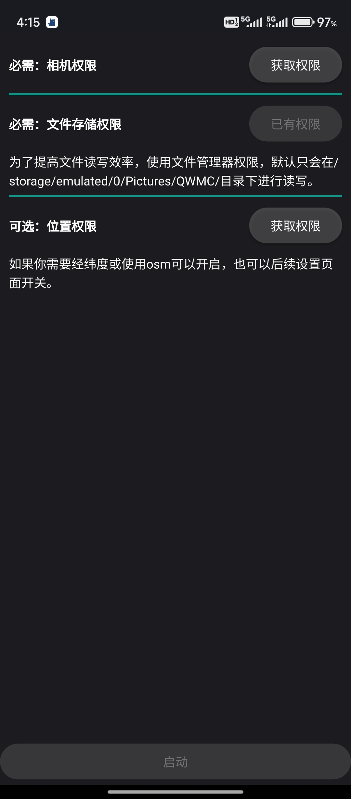
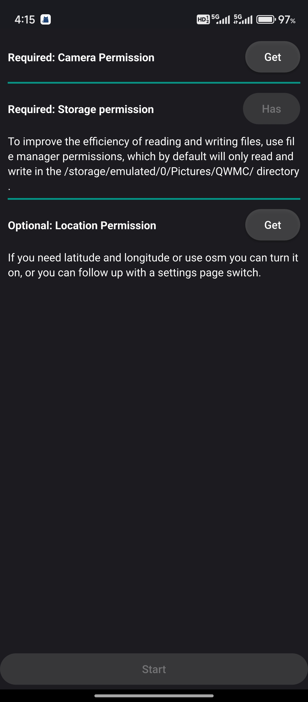
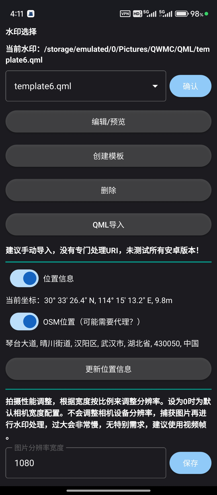
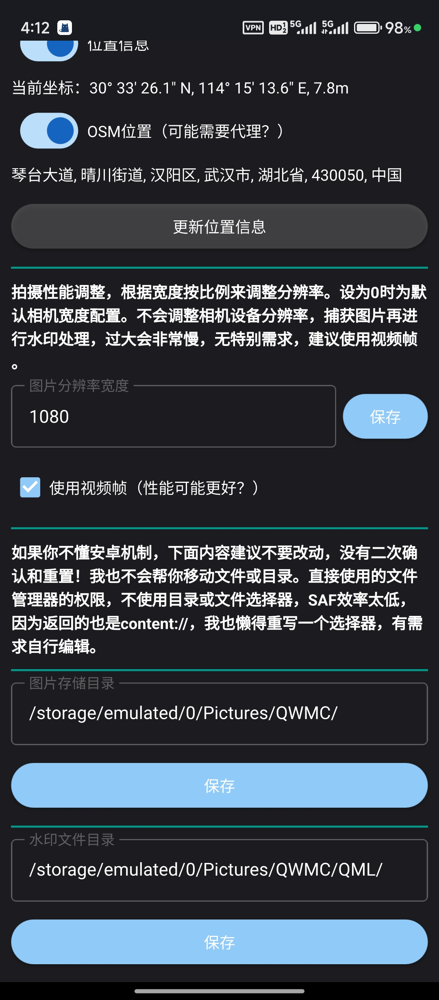
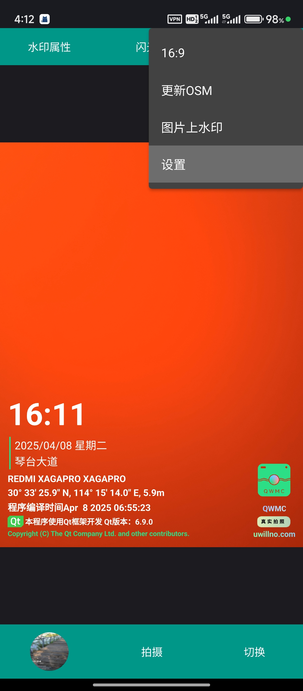
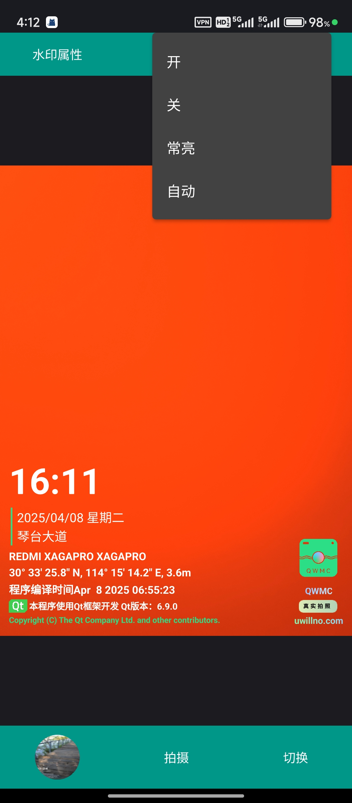
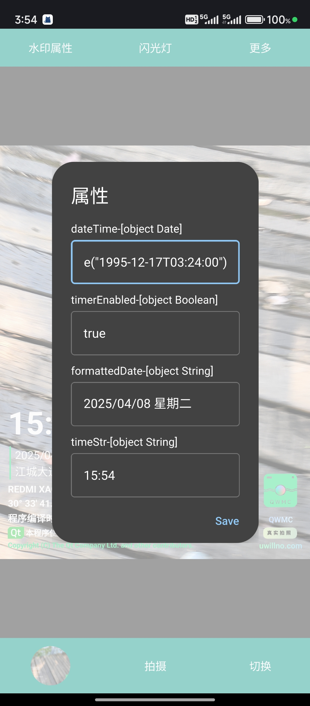
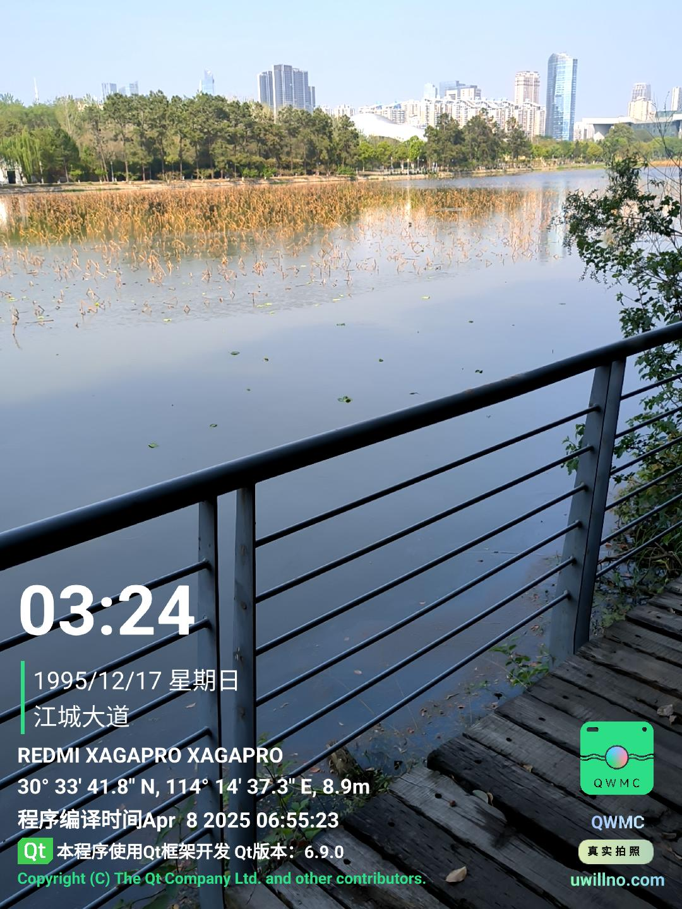
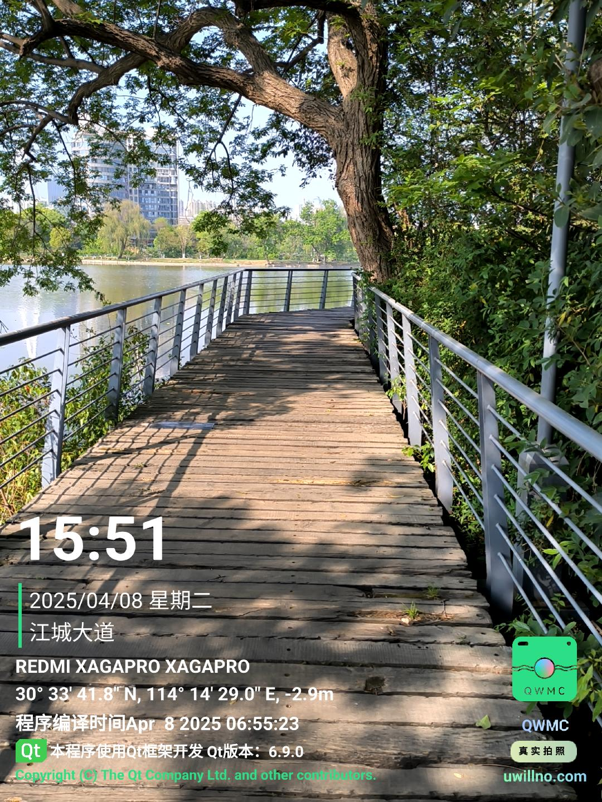
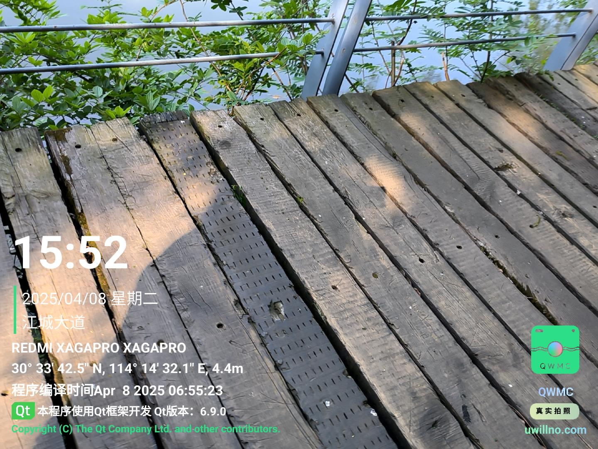
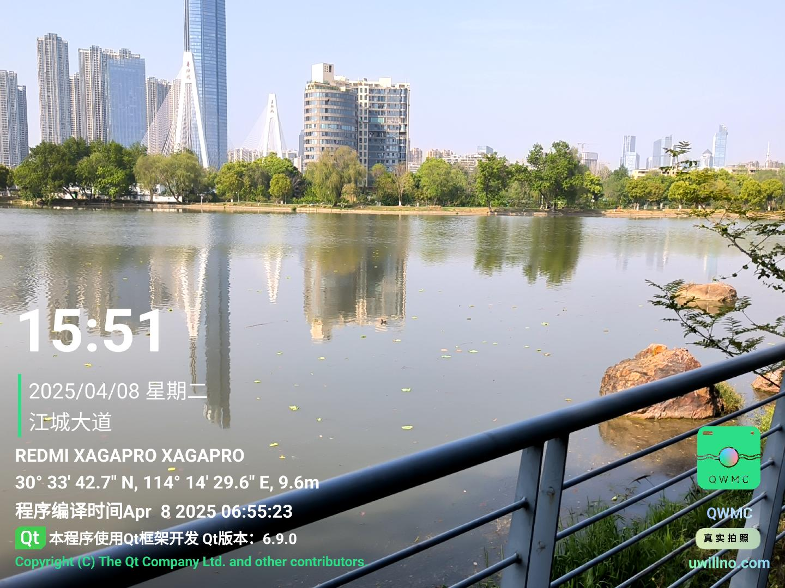
